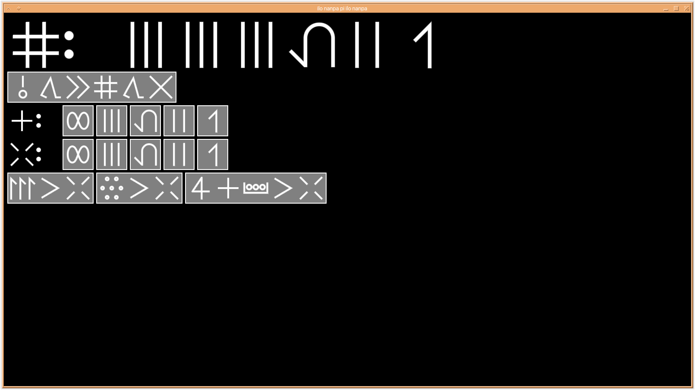
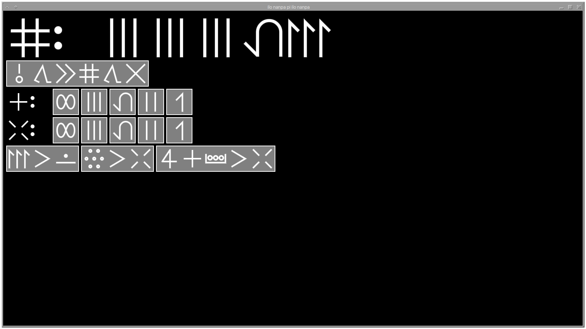
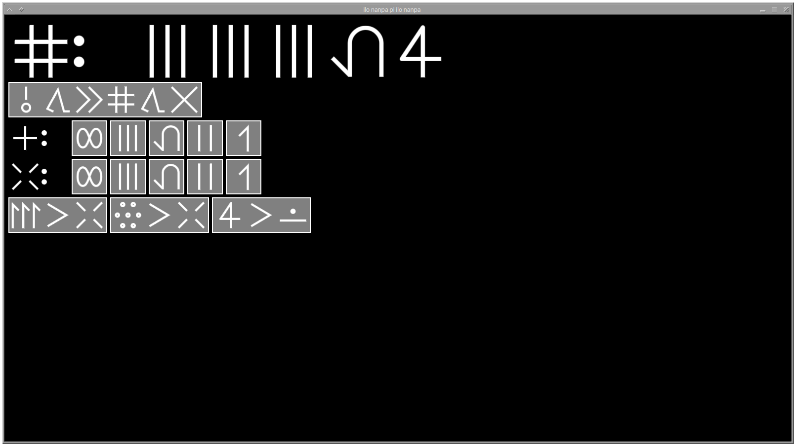
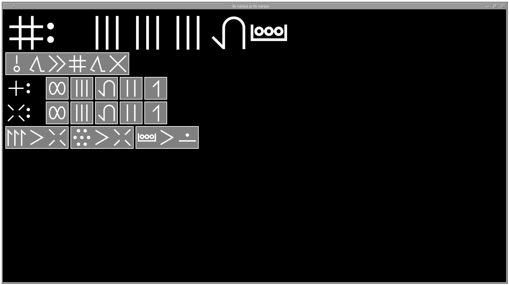
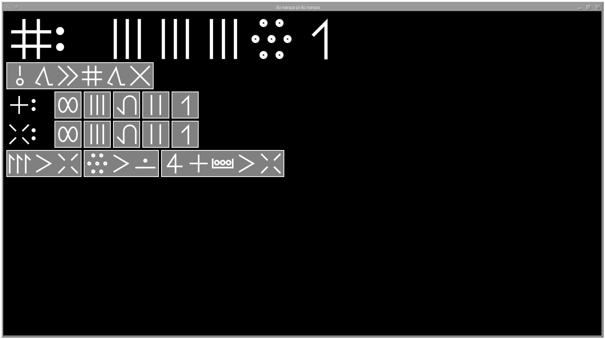

# ilo nanpa pi ilo nanpa

ni li ilo nanpa. mi pali e ona kepeken ilo toki "Zig". ona kepeken sitelen lukin ["Fairfax Pona HD"](https://www.kreativekorp.com/software/fonts/fairfaxponahd/).

mi wile e ni: ona li pona tawa sina a!

# o jo kama

sina ken jo kama e ona lon lipu ["Releases"](https://github.com/Beyley/ilo-nanpa-pi-ilo-nanpa/releases).

# o pali

o jo kama e ilo toki ["Zig 0.12.0-dev.1092"](https://machengine.org/about/zig-version/).

o sitelen e ni: 
```
$ git clone https://github.com/Beyley/ilo-nanpa-pi-ilo-nanpa
$ cd ilo-nanpa-pi-ilo-nanpa
$ zig build run
```

# o ante e nimi

## taso pu



## sina ante e ona la ona kepeken san kepeken po kepeken neja kepeken likujo

### san



### po



### neja



### likujo


